# 📝 React TODO App

A simple TODO list application built with **React** and **SASS**, allowing users to manage their tasks with an intuitive interface and theme support.

## 🌟 Features

- Add, edit, and delete tasks
- Mark tasks as complete/incomplete
- Filter tasks: All / Complete / Incomplete
- Light and dark theme toggle
- Input validation using **Yup**
- Error messages and styling based on validation
- Responsive design

> ⚠️ Note: This app uses React `useState` for state management and does not persist tasks after a page reload.

## 🚀 Tech Stack

- [Vite](https://vite.dev/)
- [React](https://reactjs.org/)
- [Yup](https://github.com/jquense/yup) for form validation
- [SASS](https://sass-lang.com/)
- [Lucide Icons](https://lucide.dev/) for UI icons

## 📸 Screenshots

### Light Theme

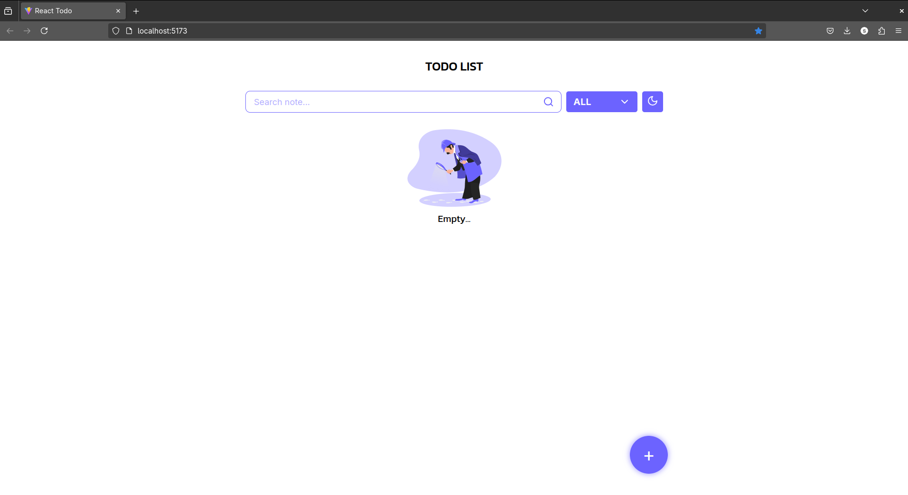
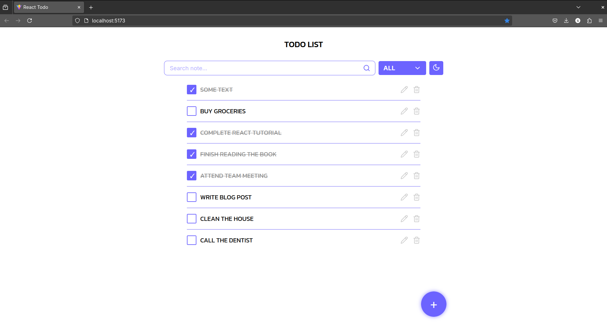

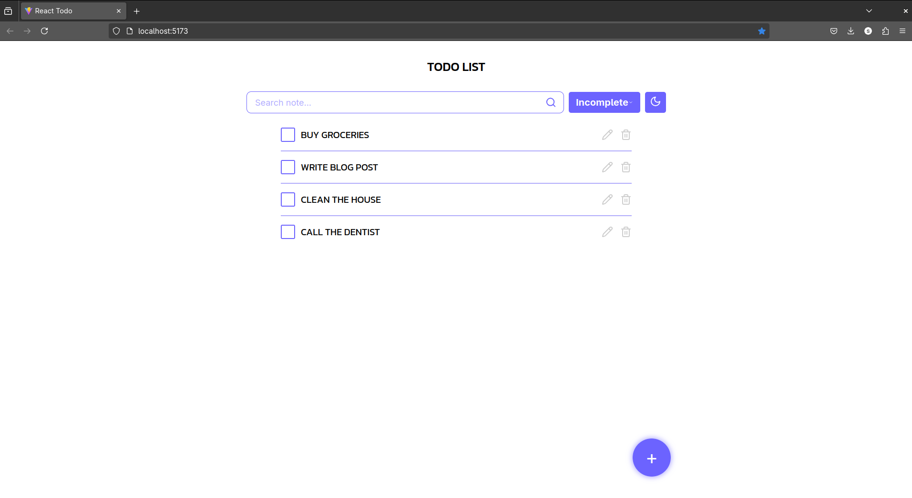
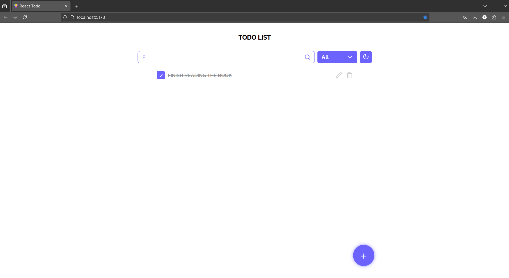
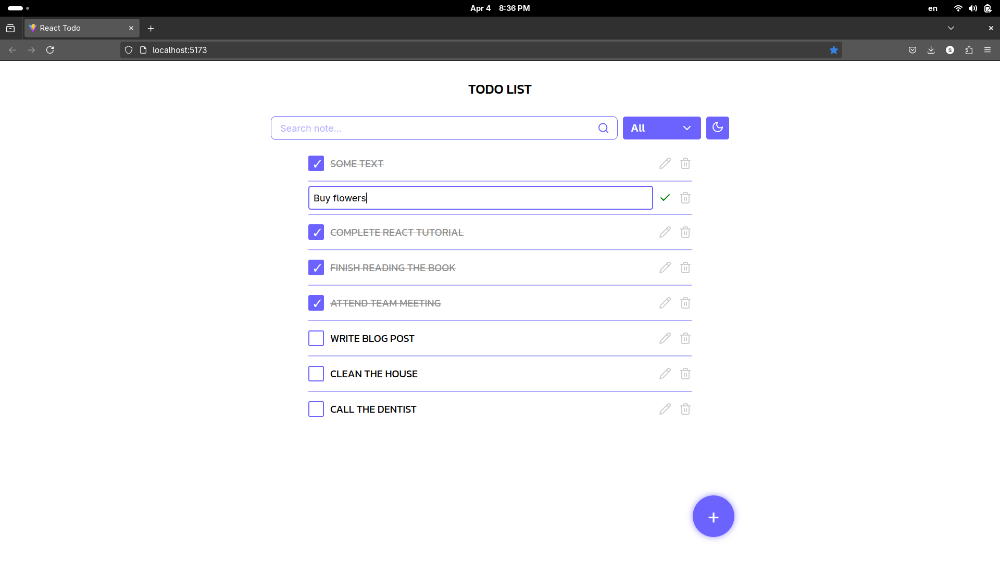
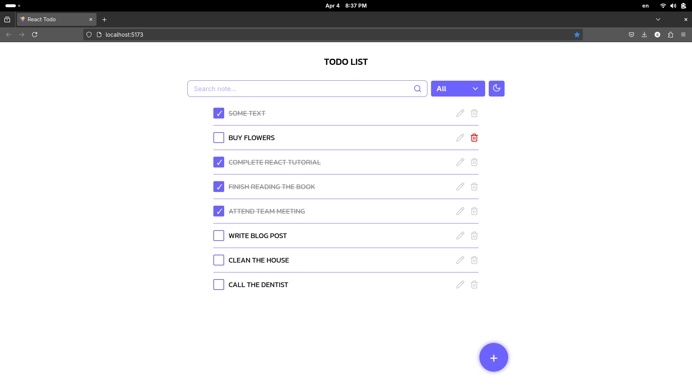
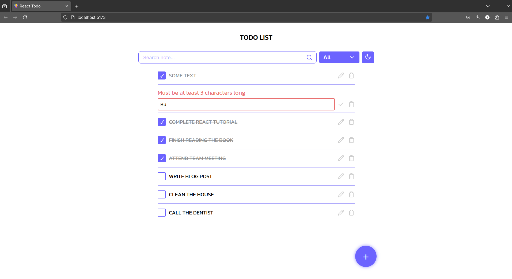

### Dark Theme

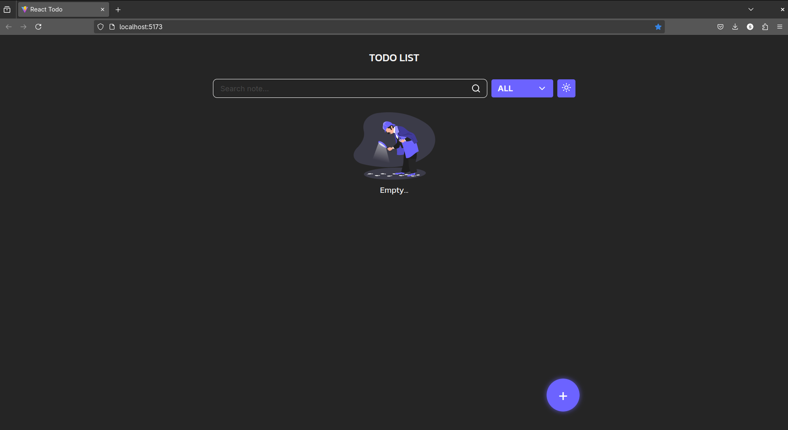
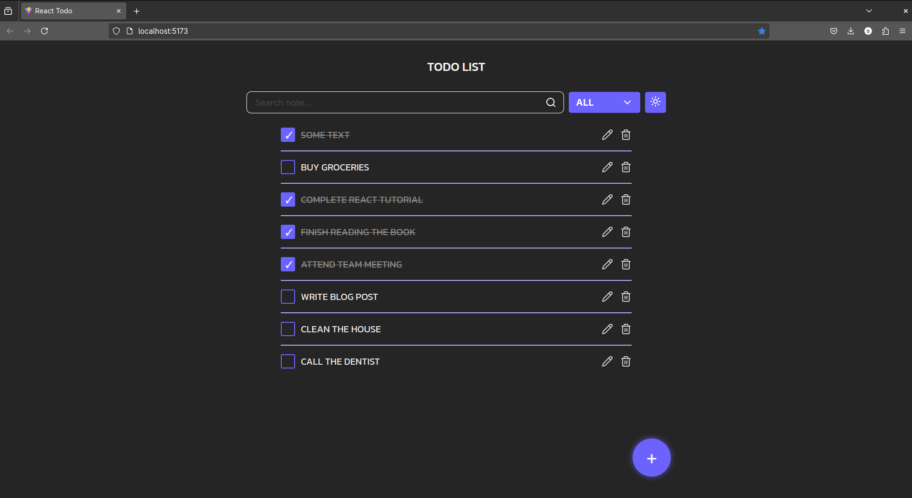
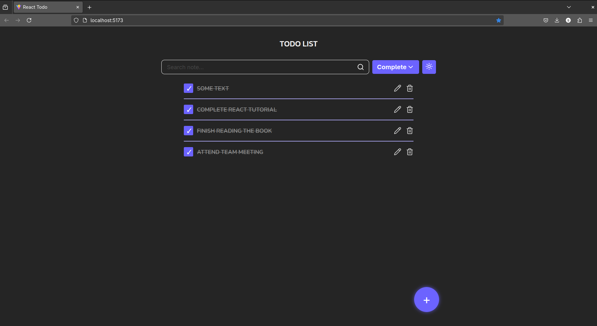
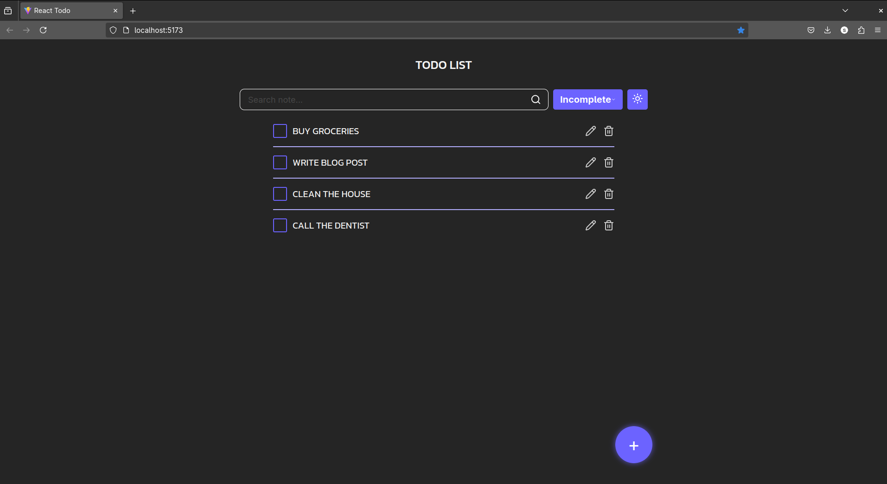
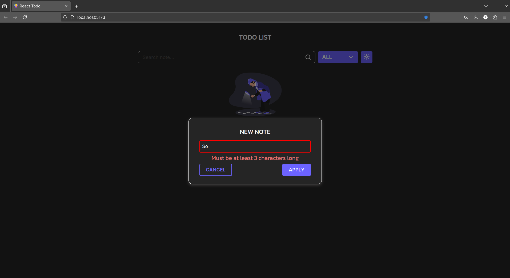

## 🔧 Installation

```bash
git clone https://github.com/victoriastruk/react-todo
cd react-todo
npm install
npm run dev
```

## 📁 Folder Structure

```
react-todo/
├── eslint.config.js
├── index.html
├── package.json
├── package-lock.json
├── public
│   └── vite.svg
├── README.md
├── src
│   ├── App.jsx
│   ├── assets
│   │   ├── comlete-dark.png
│   │   ├── comple-incom-dark.png
│   │   ├── complete-light.png
│   │   ├── dark-theme.png
│   │   ├── delete-light.png
│   │   ├── edit-light.png
│   │   ├── incomplete-dark.png
│   │   ├── incomplete-light.png
│   │   ├── light-theme.png
│   │   ├── list-task-light.png
│   │   ├── react.svg
│   │   ├── serch-light.png
│   │   ├── vaidation-edit-light.png
│   │   └── validation-dark.png
│   ├── components
│   │   ├── AddNewNoteModal
│   │   │   ├── AddNewNoteModal.module.sass
│   │   │   └── index.jsx
│   │   ├── AddTaskButton
│   │   │   ├── AddTaskButton.module.sass
│   │   │   └── index.jsx
│   │   ├── DropDown
│   │   │   ├── DropDown.module.sass
│   │   │   └── index.jsx
│   │   ├── FilterNote
│   │   │   ├── FilterNote.module.sass
│   │   │   └── index.jsx
│   │   ├── MainTitile
│   │   │   ├── index.jsx
│   │   │   └── MainTitle.module.sass
│   │   ├── NoteList
│   │   │   ├── Detective-dark.png
│   │   │   ├── Detective.png
│   │   │   ├── index.jsx
│   │   │   └── NoteList.module.sass
│   │   └── ThemeToggleBtn
│   │       ├── index.jsx
│   │       └── ThemeToggle.module.sass
│   ├── contexts
│   │   └── themeContext.jsx
│   ├── index.css
│   ├── main.jsx
│   └── pages
│       └── MainPage.jsx
└── vite.config.js
```

## 📌 To Improve

- Use `classnames` for cleaner dynamic class handling
- Save tasks using `localStorage`
- Add animations or drag-and-drop functionality

## 📜 License

This project is licensed under the MIT License - see the [LICENSE](LICENSE) file for details.

---

Made with ❤️ by Viktoriia Struk
